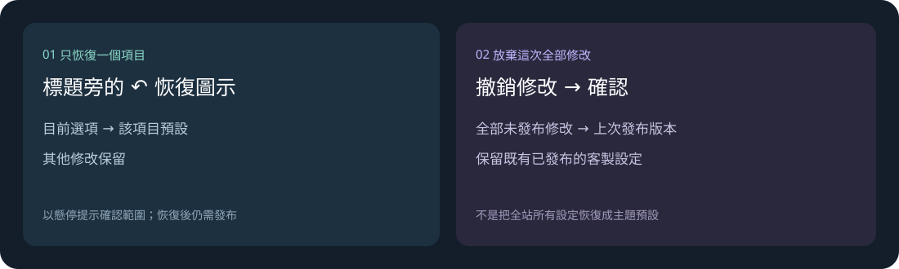

# 個性化改版說明

有秩序地修改外觀

[開啟說明頁](presentation.html) · [後台 Demo](index.html) · [Figma](https://www.figma.com/design/xG6cTjy5oxZmtdmtPknBly/NGSS3?node-id=977-1295)

先選本站主題，再調整需要的功能。邊改邊看玩家畫面，確認後再發布。

## 操作邏輯

### 本站用什麼，玩家能選什麼

- 管理員設定本站預設的主題與配色，也決定哪些選項要開放給玩家。
- 玩家只能選已開放的外觀。在右側預覽試選，不會改掉本站預設。

### 外觀和功能分開調整

- 預覽卡片：挑選元件的排版與外觀，只會看到目前主題的樣式。
- 細部選項：用按鈕選呈現方式、用開關決定是否顯示；功能較多時，再從清單挑選。

### 現行樣式要不要留，由團隊決定

- UI 與 PD／PM 一起比較現行樣式和新設計，再決定哪些保留、哪些替換。
- 首頁按區塊調整，例如遊戲分類和遊戲排列，沒有獨立的「首頁版面」總選項。

PH、IN、SF 目前各有一種配色，每個元件也只有一種樣式。仍可調整的功能會留在左側選單；固定項目會隱藏。切換本站主題會載入新主題預設，不帶入原主題的外觀設定。

辨認狀態：左側色塊是正在編輯的項目，亮起的筆形圖示表示有修改。標題右邊的圖示可查看預設或自訂狀態，也能恢復設定、開關元件。滑鼠停在圖示上，或用鍵盤移到圖示，就能看說明。

## 主要操作方式

1. **找物件**：從左側分類或搜尋找設定，分類可以收起。沒有可調整內容的項目會隱藏。
2. **選樣式、調細節**：有多種樣式時，直接點卡片選擇，再調細部設定，不用先開啟編輯模式。
3. **看玩家畫面**：切換頁面、登入前後與寬度，查看玩家會看到什麼。會讓必要入口消失的選項無法選取。
4. **核對並發布**：點「發布」，核對目前設定與修改後的差別，沒問題再點「確認發布」。

## 恢復設定

只改回一個設定，用該項目的恢復圖示；想放棄這次全部修改，則用「撤銷修改」。

## 操作情境：我要做什麼？

### 評估現行樣式是否保留

**操作**：UI 與 PD／PM 對照「樣式1（現行）」和新設計，看看各自適合什麼情境、操作上有什麼不同。

**決定**：決定保留現行選項，或換成新設計。放在一起比較，不代表最後全部都會留下。

### 組合首頁

**操作**：在遊戲分類選樣式，再到「細部設定」調分類按鈕與資金快捷區。遊戲排列、活動摘要各自調整；只會顯示這個主題能調的項目。

**結果**：各區塊合起來就是首頁，不需要另外選一套整頁版面。

### 固定品牌、開放配色

**操作**：在「主題與顏色」設定本站預設和玩家可選範圍。例如 NG 可以只開放橙白、藍白；PH、IN、SF 目前各只有一種配色。

**結果**：本站預設必須是已開放的選項。只開放一種，玩家就固定使用那一種。

### 只試看，不改本站

**操作**：在右側預覽選頁面、玩家配色與主題。登入前後在右上切換，寬度在底部選擇，也可以自己輸入。

**結果**：這些操作只改預覽。主題或配色只剩一種時，下拉選單會停用；把滑鼠停在配色、主題標籤上，可看玩家選項的說明。

### 調整底部導航

**操作**：分別設定登入前、登入後的入口，用左右箭頭調整順序。

**結果**：兩組分開儲存。每個位置都要有入口，同一組不能放重複功能，也不能移除必要入口。

### 替換 App 下載位置

**操作**：在要調整的登入狀態下，開啟「App 下載替代入口」，再選要換上的功能。

**結果**：只替換原有的 App 位置，不會多出一顆按鈕。導航沒有 App 入口時，就用不到這個設定。

### 補充入口或關閉區塊

**操作**：主題有提供「替代按鈕」時，可選它放哪裡、連到什麼功能，以及登入前後何時顯示。要隱藏元件，用標題旁的開關。

**結果**：不支援的位置，或會讓必要入口消失的選項，會直接停用並說明原因。需要保留的元件不能關閉。

### 只恢復遊戲分類樣式

**操作**：先看遊戲分類標題旁恢復圖示的提示，再點圖示恢復樣式。

**結果**：只把樣式改回主題預設，遊戲分類的細部設定和其他修改都保留。這項恢復也要發布才會生效。

### 放棄這次全部修改

**操作**：點「撤銷修改」，確認要放棄這次尚未發布的修改。

**結果**：回到上次發布的版本，當時已存好的客製設定仍在。這個操作不會把全站重設成主題預設。

### 確認修改後發布

**操作**：看完預覽後點「發布」。不需要另外開檢查面板或勾選複核；無法發布時，按畫面提示刷新預覽或重新載入已發布設定。

**結果**：核對「目前／變更後」，沒問題再點「確認發布」。重新載入已發布設定會放棄尚未發布的修改，操作前會請你確認；只看預覽不會發布。

## 前端與設計規格

### 前端開發人員

- 現行樣式替換：依 UI／PD／PM 的決定保留樣式 ID。替換選項時，要定義舊設定怎麼對應到新值、找不到對應時用什麼設定，不能只刪畫面上的卡片。
- 恢復的界線：遊戲分類的「恢復樣式」只改樣式，要保留細部設定。「撤銷修改」則回到上次發布版本，不能做成全站恢復主題預設。
- 兩組導航：登入前後的導航分開儲存，「我的／帳戶」要當成同一個入口判斷重複。App 替代只換掉既有位置，不能增加槽位。
- 相依驗證：選取前就要確認入口的位置、登入範圍，以及必要功能是否仍能進入；儲存時也要保留防護。只有資料完全相同時才能省略重複驗證。安全的替換不再要求人工複核。
- 局部更新：切換同一主題的樣式時，保留已輸入內容；操作 App 開關時，避免重建控制項造成跳動或失去焦點。預覽的頁面、登入狀態、主題、配色與寬度不能寫入本站設定。

### UI 設計師

- 現行選項決策：和 PD／PM 逐一確認：哪些物件保留現行樣式，哪些改用新設計，並列清楚新舊對應。
- 依物件分類設計：以後新增樣式或主題，沿用後台的物件分類，例如遊戲分類、遊戲排列、底部導航。同一物件的新設計放在原分類，並歸到它所屬的主題。
- 分清樣式與細部設定：排版或外觀不同，放在主樣式；分類按鈕、資金快捷區這類調整放在細部設定，不用另開一個物件。
- 新主題的物件對應：按既有分類提供新主題的樣式與預設搭配，標明哪些設計共用、哪些新增、哪些不適用。共用設計也要各自歸到主題下，不能讓操作者跨主題挑元件。
- 新增分類的條件：用途和現有物件不同時，再找 PD／PM 確認要不要新增分類。只是換外觀，就留在原分類。

## 簡報與圖示

點「簡報模式」後，用左右方向鍵切換章節，按 Esc 結束。列印時各章會分頁。工作區與恢復範圍的兩張圖都是操作示意，並非實際截圖。
